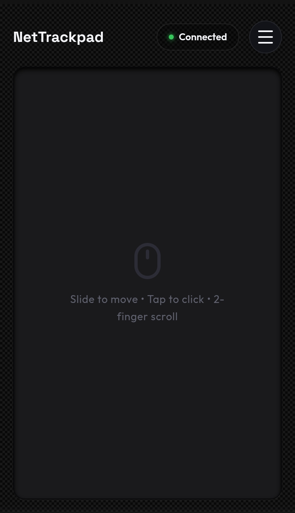

# NetTrackpad

Ever felt the need for an emergency mouse? Here is NetTrackpad. A locally connected mouse (uses TCP, so it may have a tiny bit of latency with high traffic networks) that allows you to turn any smartphone browser into a premium, responsive trackpad for your Linux laptop.



It operates directly with the Linux kernel's input subsystem via `/dev/uinput`, bypassing Wayland security restrictions to offer native relative cursor control, double-tap-to-drag selection, two-finger scrolling, and multi-touch gestures.

## Features

- Full-Screen Trackpad: Clean, button-free canvas optimized for mobile viewports.
- Tap to Click: Single-tap for left click, double-tap for double click.
- Two-Finger Tap: Tap with two fingers for right click.
- Tap-to-Drag: Double-tap and hold, then slide to select text or drag windows.
- Scroll Gestures: Drag two fingers up/down on the trackpad or use the scrollbar on the right.
- Settings Drawer: Slide-up settings menu to adjust sensitivity, toggle tap-to-click, toggle scrollbar visibility, or toggle natural scrolling direction.
- Local Security: Connection is PIN-protected with a random 4-digit code generated at server startup.

## Prerequisites

- Linux OS (tested on Ubuntu 24.04 with Wayland).
- Python 3.12+.
- Read/Write permissions for `/dev/uinput`.

## Installation and Setup

1. Open your terminal in the project directory.

2. Activate the Python virtual environment:
   ```bash
   source venv/bin/activate
   ```

3. Start the server:
   ```bash
   python3 server.py
   ```

4. The server will print a Local Link (e.g., `http://192.168.1.57:8000`), a connection PIN, and a QR code directly in the terminal.

5. Connect your smartphone to the same Wi-Fi network as your laptop.

6. Scan the QR code or open the link on your phone, enter the PIN, and click Connect.

## Settings Configuration

Tap the hamburger menu (☰) at the top-right of the mobile screen to configure:
- Sensitivity: Adjust the cursor speed (saved automatically in browser storage).
- Tap to Click: Enable or disable tapping for left clicks.
- Scrollbar: Hide the scrollbar column to give the trackpad maximum horizontal width.
- Natural Scroll: Toggle between natural scrolling (dragging down scrolls content down) and traditional scrolling.
- Fullscreen: Lock the webpage to full screen to prevent mobile browser navigation gestures from interrupting tracking.

## Advanced Launcher Options

You can specify a custom port, static password, or custom local domain name when launching the server:
```bash
python3 server.py --port 9000 --password mysecretpassword --domain nettrack.local
```

### Local Domain Name Configuration

By default, the server broadcasts `nettrack.local` on your local network using Multicast DNS (mDNS). This lets you connect simply by going to `http://nettrack.local:8000` (or scanning the QR code) without needing to know the server's IP address.

* **Using `.local` (Recommended)**: Modern systems (iOS, Android 12+, macOS, Windows 10/11, Linux) natively support `.local` domain names. No network configuration is required.
* **Using custom TLDs like `.pad` (e.g. `nettrack.pad`)**: Standard mDNS resolvers only search the `.local` TLD. If you use a custom domain like `nettrack.pad`, you must configure a local DNS server on your network (such as Pi-hole, AdGuard Home, dnsmasq, or custom router DNS settings) to map `nettrack.pad` to your computer's local IP address.


## Troubleshooting: Permission Denied to /dev/uinput

If the script fails to start with a permission error on `/dev/uinput` (common when running under a different user or machine), run the following commands to configure system permissions:

```bash
# Create a uinput group
sudo groupadd -f uinput

# Add your user to the group
sudo usermod -aG uinput $USER

# Add a udev rule to allow the group to read/write to the uinput device
echo 'KERNEL=="uinput", MODE="0660", GROUP="uinput", OPTIONS+="static_node=uinput"' | sudo tee /etc/udev/rules.d/99-uinput.rules

# Load the uinput kernel module
echo "uinput" | sudo tee /etc/modules-load.d/uinput.conf
sudo modprobe uinput

# Reload the udev rules
sudo udevadm control --reload-rules
sudo udevadm trigger
```

Log out of your Linux session and log back in for the group membership changes to take effect.
